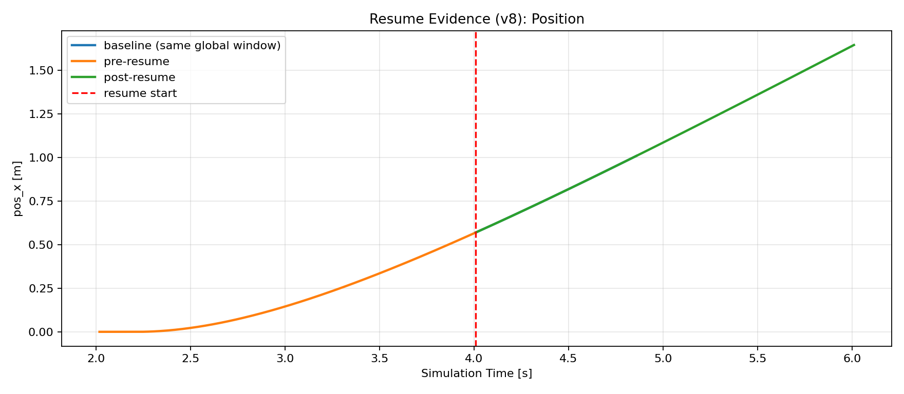
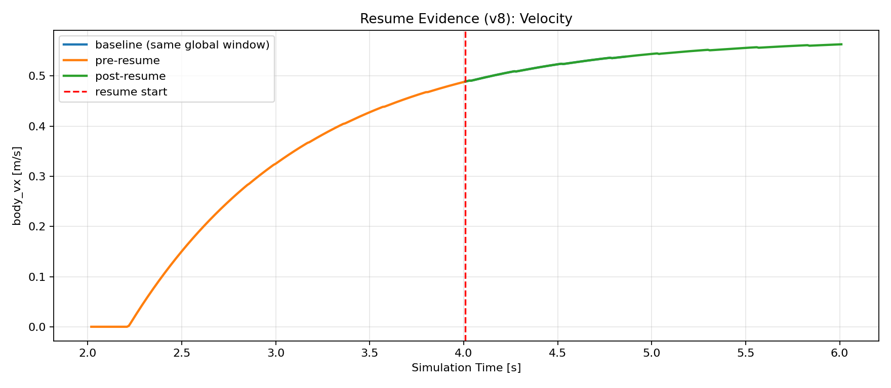
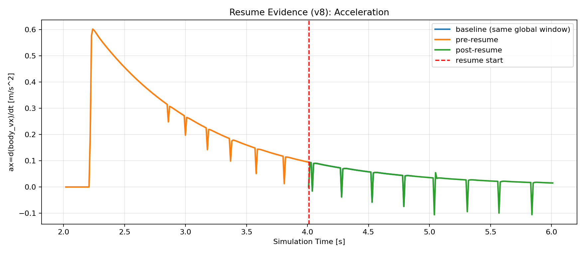

# hakoniwa-mujoco-robots

[English](README.md) | 日本語

## TL;DR
- 本リポジトリは、**Hakoniwa向けにMuJoCo物理アセットを接続する資産集**です。  
- 目的は、PDU連携で**C++シミュレータ（MuJoCo）とPython制御**を統合し、分散実験の基盤を作ることです。  
- 重要機能として、**フォークリフト本体＋制御状態のコンテキスト退避・復旧**を実装しています。  
- 設定は移行期のため **C++=compact JSON / Python=legacy JSON** を使い分けます。  
- 最短実行は「3ターミナル（sim / python / `hako-cmd start`）」です。  

---

## Why（なぜこのリポジトリが必要か）

Hakoniwaは、PDUベースのI/Fで複数プロセス・複数言語・分散構成を接続するシミュレーション基盤です。  
このリポジトリは、その中にMuJoCoを「高忠実度の物理アセット」として組み込みます。

狙いは次の3点です。

- **高忠実度物理の実装層**をHakoniwaに差し込む
- **Python制御（自動操縦/外部ロジック）**と疎結合に連携する
- **実験継続性（退避・復旧）**を担保し、将来のRD（Runtime Delegation）に備える

特にコンテキスト退避・復旧は、以下の前提機能です。

- 長時間実験の途中再開
- 手動停止/再起動の継続
- 障害復旧
- 実行所有権移動（RD）の土台

---

## What（何が入っているか）

- MuJoCoモデル（フォークリフト、ローバー）
- Hakoniwa連携C++サンプル
- PythonコントローラAPI/サンプル
- Docker実行環境（Ubuntu 24.04）
- フォークリフト向けコンテキスト退避・復旧（状態ファイル + 監査ログ）

### ディレクトリ
- `models/` MuJoCo XMLモデル
- `config/` PDU設定JSON
- `src/` C++シミュレータ実装
- `python/` Python制御コード
- `docker/` Dockerfile/実行スクリプト
- `logs/` 実行ログ（生成物）
- `tmp/` 状態ファイル（生成物）

---

## Architecture

Hakoniwaをハブとして、MuJoCo（C++）とPython制御がPDUで接続されます。

- **Hakoniwa**: 実行同期・PDU基盤
- **MuJoCo C++ Asset**: 物理計算とPDU read/write
- **Python Controller**: 目標値指令（API制御）
- **PDU JSON**: 双方の契約（チャネル・型・サイズ）

```text
+-------------------+         PDU (shared contract)         +----------------------+
| Python Controller |  <---------------------------------->  | MuJoCo C++ Simulator |
| (forklift_* .py)  |                                        | (forklift*_sim)      |
+---------+---------+                                        +----------+-----------+
          |                                                            |
          |                   Hakoniwa runtime                         |
          +--------------------(sync / mmap / PDU)---------------------+
```

---

## 箱庭コア機能サマリー（サンプル読解ガイド）

このリポジトリのサンプルは、次の3層を前提に読むと全体像を掴みやすくなります。

- `hakoniwa-core-cpp`（シミュレーションハブ本体）
  - 共有メモリ（主に `mmap`）上で、時刻同期とPDUバッファ管理を担う中核層
  - `hako-master` が実行状態とPDU領域を管理
- `hakoniwa-core-pro`（運用/API拡張層）
  - アセットAPI、コマンド、実行制御を提供
  - 典型API: `hako_conductor_start()` / `hako_asset_register()` / `hako_asset_start()` / `hako_asset_pdu_read()` / `hako_asset_pdu_write()`
  - `hako-cmd` による `start` などの外部操作はこの層
- `hakoniwa-pdu-registry`（PDU型定義・生成資産層）
  - ROS msg由来のPDU型、サイズ、オフセット、変換コードを生成・管理
  - バイナリは `[MetaData(24B)] + [BaseData] + [HeapData]` のレイアウト
  - MetaData は現行PDU仕様で固定長 24B（参照: [`hakoniwa-pdu-registry` README](thirdparty/hakoniwa-core-pro/hakoniwa-pdu-registry/README.md)）

### サンプル読解に必要な最小知識

- `pdu_size` は「型そのもののサイズ」ではなく、**PDU総サイズ（MetaData込み）**で扱う
  - 例: `Int32` 本体サイズ 8B でも、設定上は `24 + 8 = 32` を使う
- 設定は移行期のため二系統
  - C++側: compact（`pdudef + pdutypes`）
  - Python側: legacy（従来の `pdudef`）
- 実行時共有領域は通常 `/var/lib/hakoniwa/mmap`

### このリポジトリでの追い方（推奨順）

1. `src/main_for_sample/forklift/main_unit.cpp`
   - MuJoCo側（C++アセット）の実行とコンテキスト保存/復帰の本体
2. `python/forklift_simple_auto.py`
   - 目標値ベースの制御ロジック（現在状態に依存しすぎない設計）
3. `config/forklift-unit*.json` と `config/safety-forklift-pdu*.json`
   - PDU契約（どのチャネルを、どのサイズでやり取りするか）

---

## RDアーキテクチャとの位置づけ（現状）

本リポジトリは、Runtime Delegation（RD）そのものを実装する層ではなく、  
**RDが成立するための物理実行基盤（Data Plane側アセット）**を提供します。

- `hakoniwa-rd-core` の責務:
  - Ownership遷移（Owner/NonOwner）
  - Epoch/Commit Pointの確定
  - Bridge再配線と制御プレーン整合
- `hakoniwa-mujoco-robots` の責務:
  - MuJoCoでの高忠実度EU実行
  - PDU入出力
  - コンテキスト退避・復旧（実行継続の前提）

要点:
- 本リポジトリは **RD完成機能ではなく前提実装** です。
- Ownership切替やCommit Point成立判定は、引き続きRDコア側の責務です。
- 本リポジトリは RD の制御API（Ownership遷移要求/受理）をまだ持ちません。RD連携は Roadmap の「コンテキスト受け渡し設計」で段階的に統合します。

### RD設計サマリー（ExecutionUnit / Ownership / commit-point / d_max）

RD（Runtime Delegation）は、分散実行中にExecutionUnit（EU）の実行責任を安全に移すための制御規約です。ExecutionUnit は論理的な実行単位、ExecutionUnitInstance は各ノード上の具体実体であり、同一EUに対して複数Instanceが存在しても Ownership（Owner/NonOwner）は常に一意でなければなりません。

切替は状態遷移に従って明示的に実行され、Epochで世代を識別し、Bridge再配線の完了確認を経て次Ownerを有効化します。重要なのは commit-point が物理同時開始点ではなく、責任と因果境界を意味論的に確定する境界である点です。したがって commit-point と新Ownerの実行開始時刻に差があっても、どの結果がどのOwner/Epochに属するかは曖昧になりません。

時間整合は bounded drift 前提で、設計時上限 d_max（分散経路では `2*d_max`）内で論理時間差を扱います。一方、d_max超過時の自動補正や障害復旧は保証外であり、運用層の判断に委ねる境界設計です。

**Note:** RDは bounded drift（d_max）前提の意味論を提供しますが、d_max超過時の自動修復・障害復旧は本仕様の範囲外です（運用層の判断）。

本READMEは実装/運用ガイド（Informative）です。  
RD意味論の最終定義（Normative）は次を参照してください。

- **Normative**: 仕様（意味論）の最終定義
- **Informative**: 実装・運用ガイド（本README）
- [Hakoniwa Design Docs](https://github.com/hakoniwalab/hakoniwa-design-docs)
- [Core Functions (JA)](https://github.com/hakoniwalab/hakoniwa-design-docs/blob/main/src/architecture/core-functions-ja.md)
- [Glossary (JA)](https://github.com/hakoniwalab/hakoniwa-design-docs/blob/main/src/glossary-ja.md)

---

## 重要な互換性ルール（移行期）

### legacy / compact の使い分け（必読）

- C++シミュレータ: **compact JSON**
  - 例: `forklift-unit-compact.json`, `safety-forklift-pdu-compact.json`
- Pythonコントローラ: **legacy JSON**
  - 例: `forklift-unit.json`, `custom.json`, `safety-forklift-pdu.json`

移行期の併存です。ここを誤ると「読めるが動かない」状態になります。

---

## 前提環境

## 1) hakoniwa-core-pro の導入（必須）

```bash
git clone --recursive https://github.com/hakoniwalab/hakoniwa-core-pro.git
cd hakoniwa-core-pro
bash build.bash
bash install.bash
```

必要に応じてパスを設定：

Linux:
```bash
export PATH=/usr/local/hakoniwa/bin:$PATH
export LD_LIBRARY_PATH=/usr/local/hakoniwa/lib:$LD_LIBRARY_PATH
```

macOS:
```bash
export PATH=/usr/local/hakoniwa/bin:$PATH
export DYLD_LIBRARY_PATH=/usr/local/hakoniwa/lib:$DYLD_LIBRARY_PATH
```

## 2) OS別補足

- macOS: `brew install glfw`
- Ubuntu: OpenGL/GLFW関連を導入
```bash
sudo apt-get update
sudo apt-get install -y libgl1 libgl1-mesa-dri libglx-mesa0 mesa-utils libglfw3-dev
```

---

## セットアップ

```bash
git clone https://github.com/toppers/hakoniwa-mujoco-robots.git
cd hakoniwa-mujoco-robots
git submodule update --init --recursive
./build.bash
```

- MuJoCoバージョンは `MUJOCO_VERSION.txt` で管理します。
- クリーンビルド:
```bash
./build.bash clean
```

---

## Quick Start（最短）

ここでは**ホスト実行**を最短手順として示します（迷わないため）。

ターミナルを3つ用意してください。

1. シミュレータ
```bash
./src/cmake-build/main_for_sample/forklift/forklift_unit_sim
```

2. Pythonコントローラ（legacy）
```bash
python -m python.forklift_simple_auto config/forklift-unit.json \
  --forward-distance 2.0 --backward-distance 2.0 --move-speed 0.7
```

3. 開始トリガ
```bash
hako-cmd start
```

互換のため `controll.bash` は当面残し、内部で `control.bash` を呼び出します。

---

## How（実行手順の詳細）

## C++サンプル

- 通常フォークリフト:
```bash
./src/cmake-build/main_for_sample/forklift/forklift_sim
```

- 単体（荷物なし、自動制御検証向け）:
```bash
./src/cmake-build/main_for_sample/forklift/forklift_unit_sim
```

- ローバー:
```bash
./src/cmake-build/main_for_sample/rover/rover_sim
```

## Pythonサンプル

- 最小自動操縦:
```bash
python -m python.forklift_simple_auto config/custom.json
```

- 単体モデル向け（legacy）:
```bash
python -m python.forklift_simple_auto config/forklift-unit.json --forward-distance 1.5 --backward-distance 1.5 --move-speed 0.7
```

- API制御サンプル:
```bash
python -m python.forklift_api_control config/safety-forklift-pdu.json config/monitor_camera_config.json
```

- ゲームパッド制御:
```bash
python -m python.forklift_gamepad config/custom.json
```

---

## Docker（Ubuntu 24.04）

イメージ作成:
```bash
bash docker/create-image.bash
```

起動:
```bash
bash docker/run.bash
```

コンテナ内ビルド:
```bash
bash build.bash
```

注意:
- Ubuntu + Docker: GUIサポート対象
- macOS + Docker: **headless推奨**（GUI非サポート扱い）
```bash
HAKO_DOCKER_GUI=off bash docker/run.bash
```

---

## Context Save/Restore（MuJoCoコンテキスト退避・復旧）

## 狙い

- 長時間実験の継続
- 中断/再開の運用性
- 障害復旧
- 将来のRD（所有権移動）に向けた前提機能

## 境界設計（退避対象）

`HakoniwaMujocoContext`（`include/hakoniwa_mujoco_context.hpp`）で退避。

- フォークリフトサブツリー状態（位置・姿勢・リフトを含む）
- フォークリフトサブツリーの物理状態（全体世界ではない）
- 制御状態（`phase`, `target_v`, `target_yaw`, `target_lift`, `step`）

### 採用したMuJoCo Context仕様（実装確定）

`HakoniwaMujocoContext`（`include/hakoniwa_mujoco_context.hpp`）で、以下を保存します。

- `ForkliftState`
  - フォークリフトサブツリーの `qpos[]`
  - フォークリフトサブツリーの `qvel[]`
  - フォークリフトサブツリーの `qacc[]`
  - フォークリフトサブツリーの `qacc_warmstart[]`
  - フォークリフトサブツリーの `qfrc_applied[]`
  - フォークリフトサブツリーの `xfrc_applied[]`
  - フォークリフト用 actuator `ctrl[]`（`left_motor`, `right_motor`, `lift_motor`）
  - `act[]`（`mjData.act`）
  - （互換/デバッグ用）base/lift の姿勢・速度スナップショット
- `ControlState`
  - `phase`
  - `target_linear_velocity`
  - `target_yaw_rate`
  - `target_lift_z`
  - `sim_step`
  - PID内部状態（`lift`, `drive_v`, `drive_w`）

実装上の保存仕様:
- 状態ファイル形式は `v8`（後方互換で `v7` / `v6` / `v5` / `v4` / `v3` / `v2` / `v1` 読み込み対応）
- autosave間隔は `HAKO_FORKLIFT_STATE_AUTOSAVE_STEPS`（既定 `1000`）
- 保存先は `HAKO_FORKLIFT_STATE_FILE`（未指定時は `./tmp/...`）

復帰時の適用仕様（`main_unit.cpp`）:
- 物理状態適用後、`lift target` を復元
- `target_linear_velocity` / `target_yaw_rate` を初期適用
- `phase=2` はセッション内ラッチ（不要な反転を抑制）

## 境界設計（退避対象外）

- 荷物・棚など外部オブジェクト状態
- 外部プロセス側の内部状態（Python内部状態など）

つまり、**完全世界スナップショットではない**ことを明示します。

## 保存/復帰

- 保存:
  - 定期autosave（step間隔）
  - 終了時保存
- 復帰:
  - 状態ファイルがあれば復元
  - なければ新規開始

互換性:
- state は **同一モデルXML** と **同一MuJoCoバージョン**（`MUJOCO_VERSION.txt`）を前提に復元します。

環境変数:
- `HAKO_FORKLIFT_STATE_FILE` 保存先
- `HAKO_FORKLIFT_STATE_AUTOSAVE_STEPS` autosave間隔
- `HAKO_FORKLIFT_MOTION_GAIN` 運動ゲイン
- `HAKO_FORKLIFT_TRACE_FILE`（既定: `./logs/forklift-unit-trace.csv`）
- `HAKO_FORKLIFT_TRACE_EVERY_STEPS`（既定: `10`）
- `HAKO_FORKLIFT_RESUME_CMD_HOLD_SEC`（既定: `2.0`、復帰後の固定時間ウィンドウ中は外部指令を全面無視）

例:
```bash
HAKO_FORKLIFT_STATE_FILE=./tmp/forklift-it.state \
HAKO_FORKLIFT_STATE_AUTOSAVE_STEPS=1000 \
./src/cmake-build/main_for_sample/forklift/forklift_unit_sim
```

## phase運用

- `phase=2`（帰り）はセッション内でラッチ運用
- 復帰時に保存済み `target_v/target_yaw` も適用し、復帰直後の挙動を安定化

## ログ確認

- `logs/forklift-unit-run.log` C++実行ログ
- `logs/control-run.log` Python実行ログ
- `logs/forklift-unit-recovery.log` 監査ログ（`START/AUTOSAVE/END`）
- `logs/forklift-unit-trace.csv` 客観評価用トレース（時系列）

成功判定（Phase2復帰）:
- `START restored=yes ... phase=2 ...`
- `Resume control phase=2 ...`
- 復帰後 `AUTOSAVE` で `phase=2` 維持

ログは `tee -a` 追記です。  
1回目/2回目は `START restored=no/yes` で区切って判定します。

### 連続性グラフ（客観評価）

トレースCSVから連続性グラフを生成します。

```bash
python -m python.plot_forklift_continuity \
  --csv logs/forklift-unit-trace.csv \
  --output logs/forklift-unit-continuity.png \
  --window-sec 8
```

復帰前後セッションを重ね描きし、以下を比較できます。
- `pos_x`
- `body_vx`（`target_v` と重ね表示）
- `yaw`
- `lift_z`
- `phase`

見方:
- `pos_x`: 復帰直後の開始値が、停止前末尾に近いこと。
- `body_vx` と `target_v`: 復帰直後の一時差分は許容しつつ、短時間で収束すること。
- `phase`: 復帰後に意図しない初期化が入らないこと。
- `yaw` / `lift_z`: 微小な段差は許容、継続的な乖離は要調査。

実運用での合格目安:
- `logs/forklift-unit-recovery.log` に `START restored=yes` がある。
- 再開後の数百msで、軌跡が停止前カーブへ再収束する。
- `phase` の連続性が復帰後の autosave まで維持される。

補足:
- `python.plot_forklift_continuity` は、`Ctrl+C` 等で発生する途中書き込み行を自動スキップします。

### 復旧確認の実測事実

`forklift_unit` の再起動試験で、以下を確認済みです（2026-02-23 実施 / MuJoCo v3.5.0（`MUJOCO_VERSION.txt`）/ state format `v8`）。

- `logs/forklift-unit-recovery.log` に
  - `START restored=yes ... step=4000 ... target_v=0.700000 ... target_lift=0.171200 ...`
- `logs/forklift-unit-run.log` に
  - `Resume control phase=1 target(v,yaw,lift)=(0.7, -0, 0.1712) step=4000`
- 同一step比較（`4010..4860`, 86点）で
  - `delta_vx mean/min/max = 0.0 / 0.0 / 0.0`
  - `delta_target_lift mean/min/max = 0.0 / 0.0 / 0.0`

これにより、少なくとも現行スコープ（フォークリフトサブツリー + 制御状態）では  
**step整列で連続復帰** が成立することを確認しています。

正式resumeエビデンス:
- `evidence/official-resume-2026-02-23-v8/`
- 生ログ一式 + グラフ + `summary.txt` を格納

位置（`pos_x`）:


速度（`body_vx`）:


加速度（`body_vx` の差分近似）:


---

## 結合テスト（forklift_unit）

目的:
- 同一引数でPython制御を再実行できること
- C++側が保存/復帰できること
- Phase継続（特にPhase2復帰）を確認すること

手順（3ターミナル）:

1. sim
```bash
bash forklift-unit.bash
```

2. control
```bash
FORWARD_GOAL_X=5.0 HOME_GOAL_X=0.0 GOAL_TOLERANCE=0.03 bash control.bash
```

3. start
```bash
hako-cmd start
```

再開テスト:
1. simを `Ctrl+C` で停止
2. 同じコマンドでsim再起動
3. controlを同じ引数で再実行
4. ログで `restored=yes` / `phase=2` を確認

---

## エビデンス運用（Phase1）

推奨手順:
1. ベースライン（無停止）を実行してグラフ生成後、成果物を退避
2. 停止/再開テストを実行してグラフ生成後、成果物を退避
3. 2つのエビデンスディレクトリを比較

`logs/` の成果物を `evidence/<case_name>/` に `mv` で退避:

```bash
bash evidence/move-logs-to-evidence.bash phase1-baseline-01
bash evidence/move-logs-to-evidence.bash phase1-resume-01
```

各エビデンスに保存されるもの:
- `control-run.log`
- `forklift-unit-run.log`
- `forklift-unit-recovery.log`
- `forklift-unit-trace.csv`
- `forklift-unit-continuity.png`
- `meta.txt`（取得時刻 + MuJoCo version）

グラフの見方は以下に記載しています:
- `Context Save/Restore -> 連続性グラフ（客観評価）`
  - `見方`
  - `実運用での合格目安`

---

## FAQ

### Q1. これはRD（Runtime Delegation）を実装していますか？
A. いいえ。  
本リポジトリはRDの制御面（Ownership遷移・Epoch管理）を実装しません。RDが成立するために必要な「物理ExecutionUnitの継続性」を提供します。Ownership遷移・commit-point確定は `hakoniwa-rd-core` の責務です。

### Q2. commit-pointとMuJoCo保存はどう関係しますか？
A. 現状では、commit-pointと自動保存は連動していません。保存は運用上のautosaveです。将来的には、RDのcommit-point到達時に保存をフックする設計を想定しています。

### Q3. d_maxとの整合はどうなりますか？
A. 本リポジトリは単一ノード内の実行を前提としています。d_maxの保証はRD層の意味論であり、本実装はその上で動作する物理ExecutionUnitです。

### Q4. なぜ完全世界スナップショットではないのですか？
A. 段階的設計のためです。現在は「フォークリフトサブツリー」と「制御状態」（＋選択したMuJoCo動力学バッファ）を保存対象としています。外部オブジェクト（棚・荷物）は将来の拡張対象です。

### Q5. MuJoCoの内部solver状態は保存していますか？
A. 一部を保存しています。保存対象は `qpos` / `qvel` / `qacc` / 制御状態に加えて、`act`、`ctrl`、`qacc_warmstart`、`qfrc_applied`、`xfrc_applied` です。ただし、MuJoCo内部状態の完全スナップショットではないため、復帰後にsolver内部の一時状態差分が残る可能性はあります。

### Q6. 物理的に完全に連続しますか？
A. 保証しません。本実装は「意味論的継続」を目的とし、ミクロな物理連続性までは保証しません。

### Q7. モデル変更やMuJoCoバージョン変更時に復旧できますか？
A. 保証しません。stateは同一モデルXML・同一MuJoCoバージョンを前提に復元します。

### Q8. legacy/compact混在は設計上の問題では？
A. 移行期のためです。最終的にはcompactへの統一をRoadmapで予定しています。

### Q9. HLAやFMIと何が違いますか？
A. 本設計は、PDUによる明示的データ契約、ExecutionUnit単位でのOwnership管理、commit-point意味論を中核にしています。マスターアルゴリズム依存の並列同期設計とは立ち位置が異なります。

本FAQは現時点の実装スコープに基づく回答です。RD意味論および分散拡張に関する最終定義は [Hakoniwa Design Docs](https://github.com/hakoniwalab/hakoniwa-design-docs) を参照してください。

---

## サンプル一覧

- `src/main_for_sample/forklift/main.cpp` フォークリフト基本連携
- `src/main_for_sample/forklift/main_unit.cpp` 単体モデル検証向け
- `src/main_for_sample/rover/main.cpp` ローバー例

---

## Roadmap

- Windows実行フローの整備（ビルド/実行/ログ）
- compactフォーマットのPython側対応（legacy依存の解消）
- 退避対象の段階的拡張（荷物・棚など）
- 復帰整合性チェックの自動化（ログ検査スクリプト）
- RD（Runtime Delegation）連携に向けたコンテキスト受け渡し設計の具体化

---

## ライセンス

MIT License
